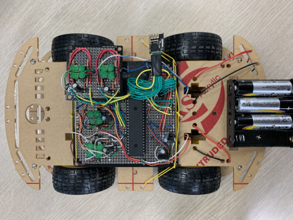
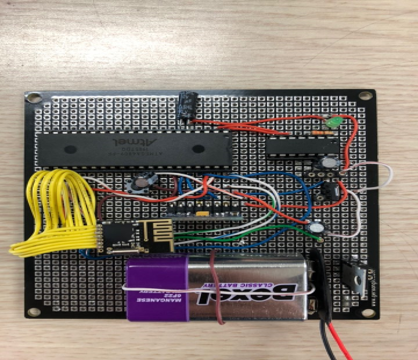

# Wireless RC car
Embedded system project    
e-mail address : jinwoong.it@gmail.com  
Demo video : https://youtu.be/z6WFaWM-ILM  

## Introduction
- This uses wireless communication between the controller and RC car.  
- Controller utilizes gyro sensor.  
- Control the speed according to the forward and back slopes and change the direction according to the right-left slopes  
- Implemented as register coding  
- Use the uart method of mcp2221 to connect with mcu
## Main Technology
- I2C(gyro sensor)  
- SPI(nrf24l01)  
- H-bridge circuits  
- PWM  
- Complementary, Kalman Filter  

## Development Environment
- Arduino IDE  
- Visual studio  

## Main used parts
- MCU : ATmega4809  
- Communication module : NRF24L01  
- Gyro sensor : MPU-6050  

## Results

